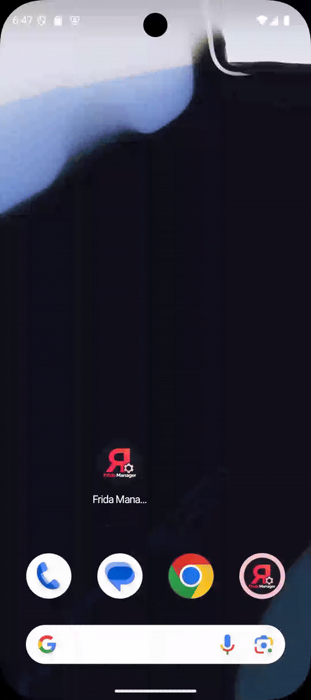
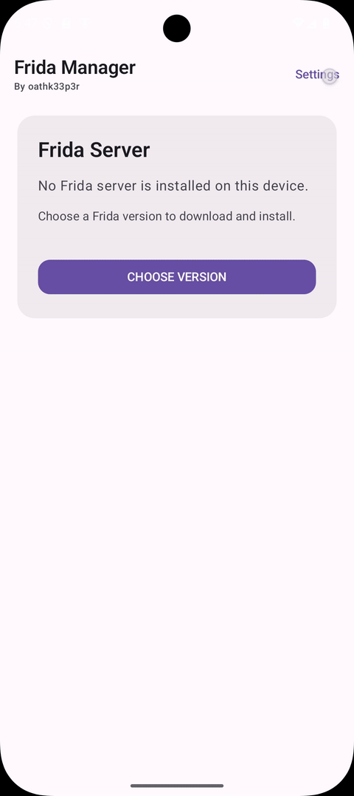
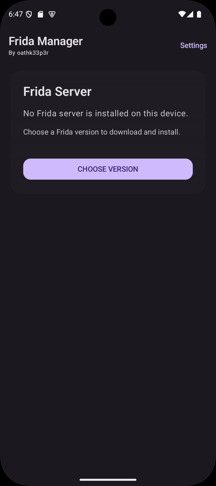
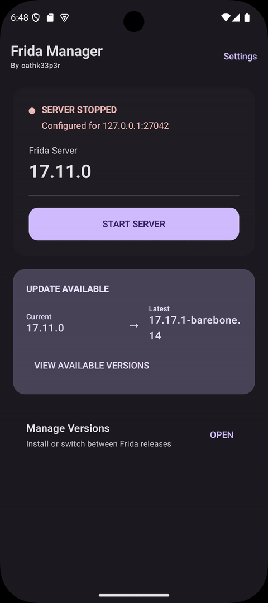
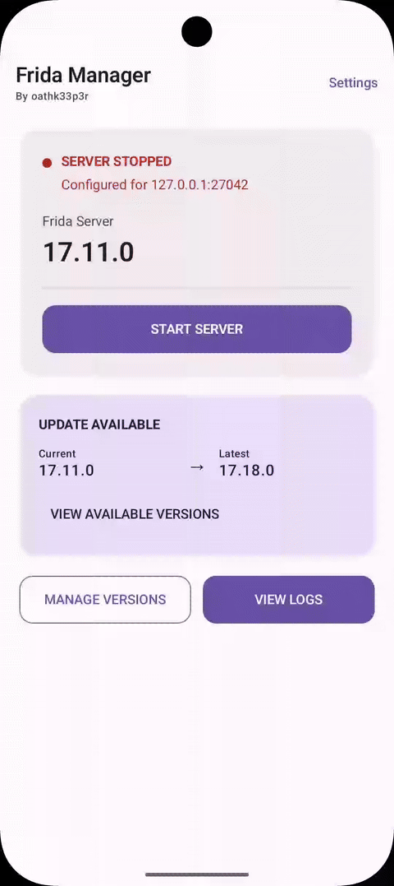
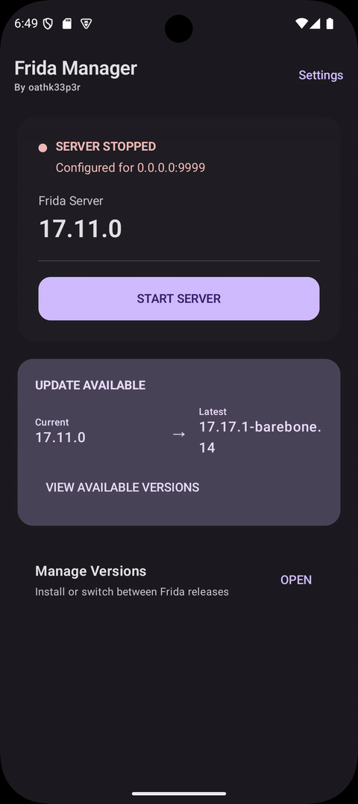
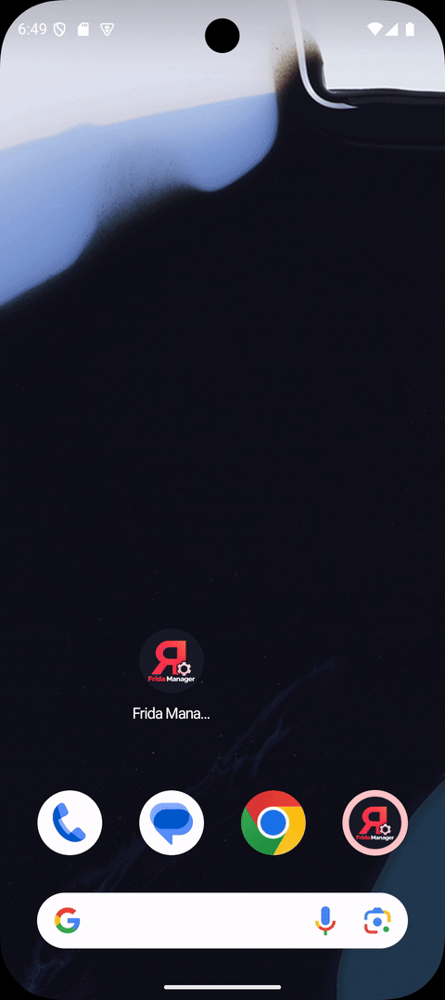
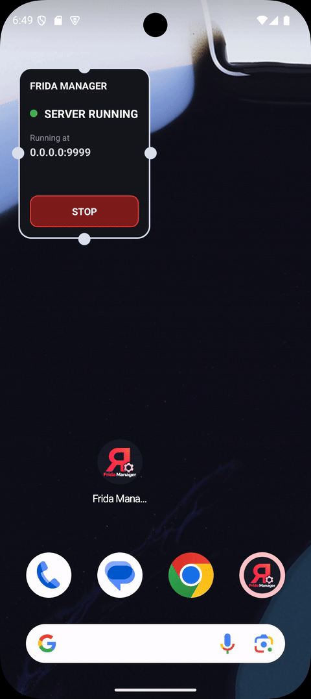
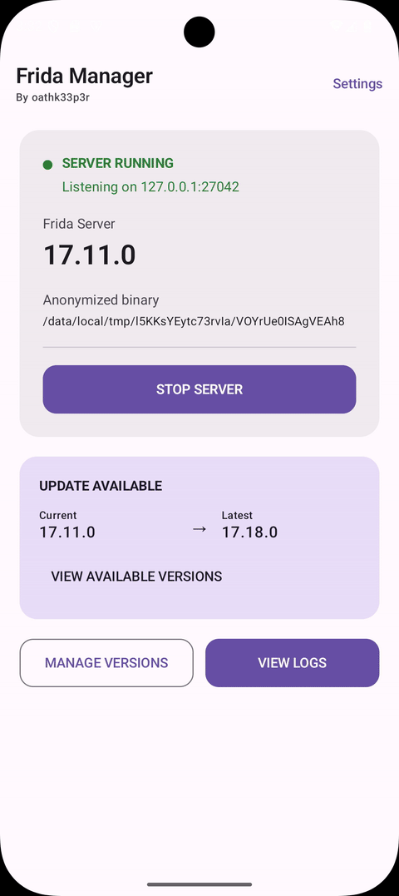

# Frida Manager

A simple Android application for downloading, installing, managing, and launching [Frida](https://frida.re/) server on rooted Android devices.

Frida Manager is designed for security researchers, mobile application testers, reverse engineers, and developers who regularly work with Frida on Android and want a convenient way to manage `frida-server` directly from their device.

---

## Why did we build Frida Manager?

Working with Frida on a rooted Android device often involves a repetitive manual process:

1. Find the correct `frida-server` version.
2. Determine the device's CPU architecture.
3. Download the correct binary.
4. Extract the `.xz` archive.
5. Copy the binary to the device.
6. Set the correct permissions.
7. Start `frida-server`.
8. Stop or restart it when required.
9. Repeat the process whenever Frida is updated.

Frida Manager was built to make this workflow significantly easier.

Instead of manually downloading and managing `frida-server`, the application provides a native Android interface for managing the server directly on the device.

### Features

#### Frida Server Management

- View available Frida releases.
- Download Frida server directly from GitHub releases.
- Automatically detect the device CPU architecture.
- Select the appropriate Frida server binary.
- Support `.xz` compressed Frida server releases.
- Install `frida-server` on a rooted device.
- Start, stop, and restart `frida-server`.
- Check whether `frida-server` is currently running.
- Display the installed Frida server version.
- View Frida logs directly from Frida Manager to help troubleshoot and monitor the running Frida instance.
- Randomise the Frida binary path to make the installation less predictable and reduce detection based on known Frida file paths.

#### Server Configuration

- Configure the `frida-server` listening IP address.
- Configure the `frida-server` listening port.
- Change network configuration without manually managing the server from a terminal.
- View available IPv4 addresses and network interfaces.

#### Home Screen Widget

- Start and stop `frida-server` directly from the Android home screen.
- Display the current server status.
- Display the configured IP address and port.
- Quickly access Frida Manager's server controls.

## Screen Recordings

### Root Access



### Settings & Dark Theme



### Frida Version Management



### IP & Port Configuration



### Server Binary and path anonymize


### Start Frida Server



### Home Screen Widget



### Widget Server Control



### Frida Logs


---

# Installation

## Requirements

Before installing Frida Manager, the device should have:

* Android device
* Root access
* A working root management solution
* Internet access for downloading Frida releases
* A supported CPU architecture
* Android version compatible with the application

Because Frida Manager manages `frida-server`, **root access is required**.

---

## Install from GitHub Releases

The easiest way to install Frida Manager is from our [Releases page](https://github.com/abhilashnigam/Android-Frida-Manager/releases/latest).

Download the latest release:

```text
FridaManager-<version>.apk
```
to the Android device.

Install the APK using the Android package installer.

Depending on the Android version and device configuration, Android may require permission to install applications from unknown sources.

After installation:

1. Open Frida Manager.
2. Grant root access when requested.
3. Select or download the required Frida server version.
4. Install the server.
5. Start `frida-server`.

The application will handle the privileged installation and execution operations.

---

# Don't trust pre-built APKs?

That's completely reasonable.

The APK distributed through GitHub Releases is a convenience for users who don't want to build the application themselves.

You can inspect the source code and build Frida Manager locally.

The repository is the source of truth for the application code.

## Build from source

### Requirements

Install the following:

* Git
* Android Studio or Android SDK
* JDK 21
* Android SDK
* Android SDK Build Tools
* Android SDK Platform
* Gradle wrapper included with the repository

The project uses the Gradle wrapper, so you **do not need to install Gradle separately**.

## 1. Clone the repository

Clone the repository:

```bash
git clone https://github.com/abhilashnigam/Android-Frida-Manager.git
cd Android-Frida-Manager
```
---

## 2. Build the application

The Gradle wrapper handles the required Gradle version.

On macOS/Linux:

```bash
./gradlew assembleRelease
```

On Windows:

```powershell
.\gradlew.bat assembleRelease
```

A successful build should end with:

```text
BUILD SUCCESSFUL
```

---

## 3. Find the APK

The generated release APK will be under:

```text
app/build/outputs/
```

For example:

```text
app/build/outputs/apk/release/
```

The exact filename can vary depending on the Android Gradle Plugin configuration.

You can find it with:

```bash
find app/build/outputs -name "*.apk"
```

---

## 4. Install the locally built APK

Using ADB:

```bash
adb install app/build/outputs/apk/release/*.apk
```

---

# Disclaimer

Frida Manager is a utility for legitimate security research, mobile application testing, reverse engineering, and development.

Users are responsible for ensuring that they have authorization to instrument, analyze, or modify the applications and devices they work with.

Neither Frida Manager nor its contributors are responsible for misuse of the software.

---

# License

Frida Manager is released under the MIT License.

See [LICENSE](LICENSE) for the complete license text.

---